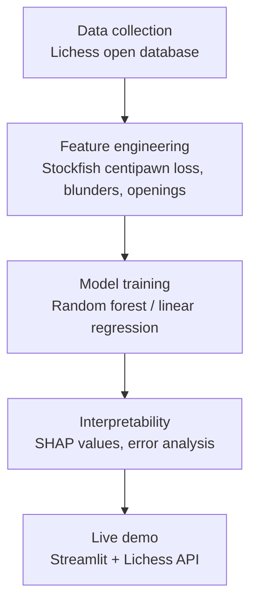
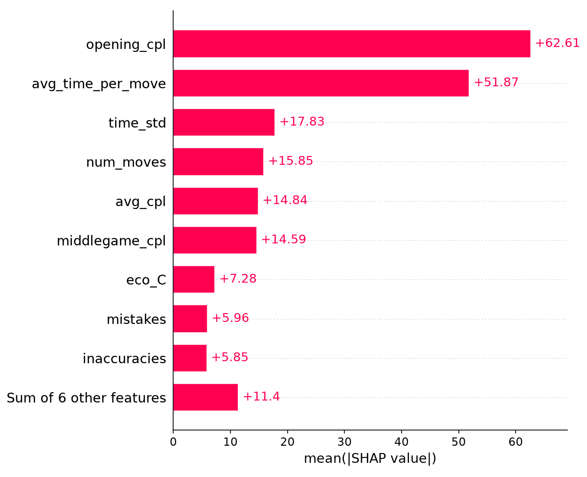
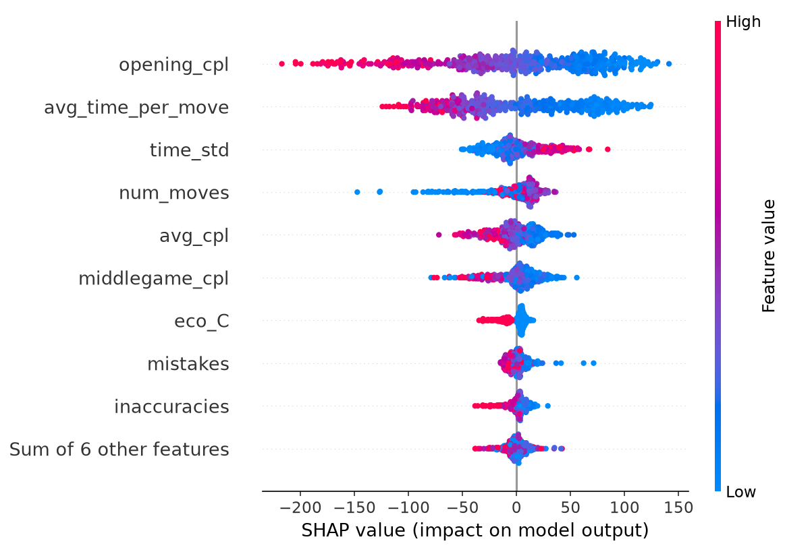

# Chess Elo Predictor

Predicting a chess player's rating from their playing style alone — no
game outcome required, just how they play.

**[Live demo →](#) &nbsp;|&nbsp; [Skip to results](#results)**

---

## The idea

A player's Elo rating is meant to summarise their skill, but skill also
shows up directly in *how* someone plays: how many mistakes they make,
where in the game those mistakes happen, how they use their clock, and
what kind of positions they choose to play. This project asks: **how
much of a player's rating can be recovered purely from measurable
properties of their games, without ever looking at who won?**

## Pipeline



## Data

Games were streamed directly from the [Lichess open database](https://database.lichess.org)
(released under CC0 — free to use for any purpose) without downloading
full monthly dumps, which run 80–90 million games and tens of
gigabytes. Instead, a script opens a streaming connection, decompresses
on the fly, and stops as soon as enough qualifying games are collected
— meaning only the portion of the file actually needed is ever
transferred.

Games were filtered to:
- Players rated **1000–2200** (this range matters — see [Limitations](#limitations))
- **Blitz or rapid** time control
- At least **15 moves** played

## Feature engineering

Each game was analysed move-by-move with the [Stockfish](https://stockfishchess.org/)
chess engine (depth 12) to compute, per player:

- **Average centipawn loss** — how far each move deviates from the engine's best move
- **Blunders / mistakes / inaccuracies** — move counts by severity (Lichess-style thresholds: 300+/100+/50+ centipawns lost)
- **Phase-specific accuracy** — centipawn loss broken out separately for opening (moves 1–15), middlegame (16–40), and endgame (41+)
- **Time usage** — average time spent per move and variability, parsed from the game's clock annotations
- **Opening family** — the broad ECO category (A–E) of opening played

## Modeling

| Model | MAE (rating points) | RMSE |
|---|---|---|
| Naive baseline (always guess the mean) | 237.7 | 288.9 |
| Linear regression (basic features) | 222.2 | 274.6 |
| Random forest (basic features) | 227.9 | 277.5 |
| Linear regression (+ phase/time/opening features) | **205.1** | 251.7 |
| Random forest (+ phase/time/opening features) | **206.5** | 253.4 |

Adding phase-specific accuracy, time usage, and opening family features
improved both models by roughly 8–9% over the basic feature set,
confirming that *when* and *how* mistakes happen carries real
predictive signal beyond a single blended accuracy number.

## Interpretability

SHAP analysis on the final random forest model showed:

- **Opening accuracy is the single strongest predictor** of rating — more
  so than overall or middlegame accuracy.
- **Very short games are a strong negative signal** — heavily pulling
  predicted rating down, plausibly reflecting quick losses/blunders
  more common at lower rating levels.
- **Average time per move was a surprisingly strong signal** — players
  who moved faster on average tended to be predicted as higher rated.
  This is a genuinely interesting but not fully explained result,
  flagged here rather than overstated.
- **Minor inaccuracies (50–100 centipawns) showed essentially no
  correlation with rating** — it's the larger errors (blunders,
  mistakes) that separate skill levels, not small imprecision.

See the visualisations below (also available as `shap_bar.png` and
`shap_beeswarm.png` in this repo).




## Results

Error analysis on held-out test data showed the model's biggest misses
were single anomalous games — a strong player having one unusually
sloppy game, or a weaker player having one unusually clean one — which
points directly at the most promising future improvement: aggregating
multiple games per player rather than treating each game independently.

Live testing against real, freshly-fetched Lichess accounts:

| Player | Predicted | Actual | Error |
|---|---|---|---|
| Player A | 1453 | 1626 | 173 |
| Player B | 1298 | 1658 | 360 |
| Player C (rated 2636, outside training range) | 1784 | 2636 | 852 |

## Limitations

- **The model cannot extrapolate beyond its training range (1000–2200).**
  Tree-based models predict by averaging training examples, so a
  player rated far above or below that range will be systematically
  mispredicted — not because the features are wrong, but because the
  model structurally cannot output ratings it never saw during
  training. The live demo flags this explicitly when it happens.
- **Each prediction is based on a small number of individual games**,
  which are inherently noisy — a single unusually good or bad game can
  skew the result. Averaging across more games per player (or
  restructuring data collection around fewer, more deeply-sampled
  players) would likely reduce this significantly.
- **Opening family (A–E) turned out to be a weak feature** — a
  reasonable proxy for style, but not a strong skill signal on its own.

## Live demo

The Streamlit app fetches a player's recent rated games directly from
the Lichess API, analyses them live with Stockfish, and predicts their
rating from playing style alone — typically in 30–60 seconds.

**Try it: [link to deployed app]**

## Running locally

```bash
pip install -r requirements.txt
```

You'll also need:
1. [Stockfish](https://stockfishchess.org/download/) downloaded and
   extracted locally (update the path in the scripts to match).
2. A free [Lichess API token](https://lichess.org/account/oauth/token/create)
   (no scopes needed), stored in `.streamlit/secrets.toml`:
   ```toml
   LICHESS_TOKEN = "your_token_here"
   ```

Then, in order:
```bash
python collect_games.py          # stream a sample of games from Lichess
python batch_analyze_v2.py       # run Stockfish feature extraction
python train_and_save_model.py   # train and save the final model
streamlit run app.py             # launch the live demo
```

## Tech stack

Python · pandas · scikit-learn · Stockfish · python-chess · SHAP ·
Streamlit · the Lichess API

## Future work

- Aggregate multiple games per player to reduce single-game noise
- Expand the training rating range beyond 1000–2200
- Try gradient boosting (XGBoost/LightGBM) with proper cross-validation
- Investigate the time-per-move finding more rigorously
- True opening *diversity* as a feature, using multiple games per player
